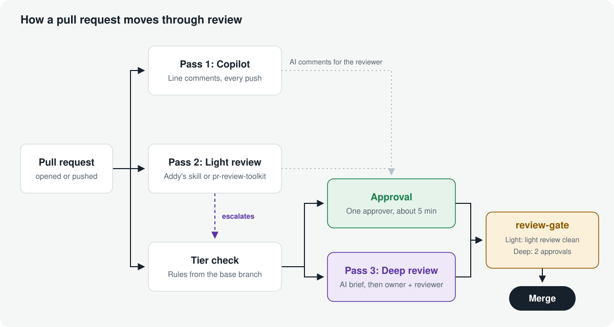
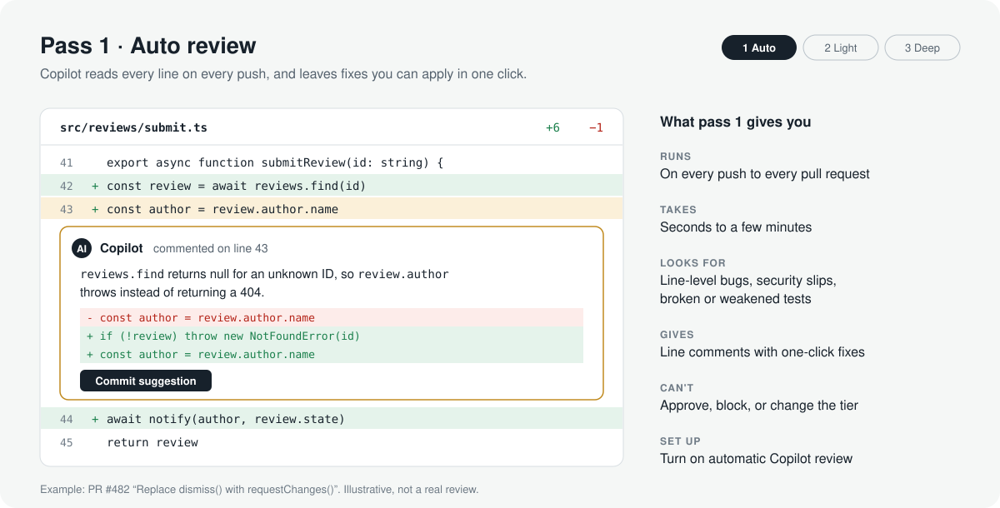
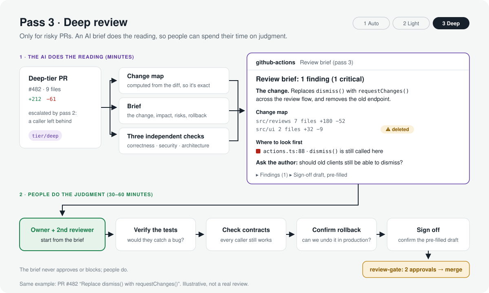

<div align="center">

# Three-Pass Review

**AI reads every line. People own the risk.**

A code review process you install in every project: two AI passes on every pull request, and a third, deeper pass only where a mistake would really hurt.

[](LICENSE)
[](docs/roadmap.md)

</div>

<p align="center">
  
</p>

## The three passes

| | What runs | On which PRs | What you get |
|---|---|---|---|
| **1. Auto review** | GitHub Copilot code review | Every push | Line comments with one-click fixes |
| **2. Light review** | An AI reviewer you choose: [Addy Osmani's `code-review-and-quality`](https://github.com/addyosmani/agent-skills/tree/main/skills/code-review-and-quality) skill, or Claude Code's [`pr-review-toolkit`](https://github.com/anthropics/claude-code/tree/main/plugins/pr-review-toolkit) | Every ready PR | One verified summary, inline comments for real problems, and an escalation when the PR needs more |
| **3. Deep review** | An AI **reviewer brief**, then the code owner and a second reviewer | Only PRs the tier check routes deep: sensitive paths, big or cross-cutting changes, deleted tests, dependency changes, escalations | The brief does the reading; people spend their time on judgment and sign off |

A **tier check**, with rules read from the base branch, decides which PRs go deep, and a required **`review-gate`** check enforces it. Automation can raise a tier but never lower one. AI never approves anything.

The pictures below follow one example PR through all three passes.

### Pass 1 · Auto review

<p align="center">
  
</p>

Copilot catches small, line-level mistakes on every push, and most fixes take one click. [More on pass 1](guide/docs/03-pass-1-copilot.md).

### Pass 2 · Light review

<p align="center">
  
</p>

A second, different AI reviews the whole change and reports only what it can prove. A clean result means the PR needs one quick approval; a serious finding sends it to pass 3. [More on pass 2](guide/docs/04-pass-2-light-review.md).

### Pass 3 · Deep review

<p align="center">
  
</p>

Deep reviews are where human time goes, so pass 3 starts with a **reviewer brief** that the owner can read in five minutes, before any code:

- **The change** in plain words, and whether it matches the PR description
- **A change map**, computed from the diff: areas touched, size, and warnings for migrations, dependencies, CI and infra changes, and deletions
- **Impact** on users and callers, **risks**, and how to **roll back**
- **Tests**: what's covered and what isn't
- **Where to look first** and **questions for the author**
- **Findings** from three independent AI checks (correctness, security, architecture)
- **A sign-off draft**, pre-filled for the reviewer to confirm or correct

[Here's a brief](test/fixtures/golden/basic_brief.md) rendered from the test fixtures (synthetic, not a real review). The brief comes from `threepass`, a tool in this repository. It runs under a hard cost ceiling, never approves or blocks, and reads the PR as data only. [More on pass 3](guide/docs/05-pass-3-deep-review.md).

## Why this setup

- **People can't read every line of AI-written code.** Two AI passes read all of it, so humans don't have to.
- **Effort follows risk.** Routine PRs need one quick approval. Risky ones get the brief and two careful reviewers.
- **Two different AI reviewers.** Fast line-level comments and a whole-PR review catch different problems.
- **A PR can't weaken its own review.** The rules, the reviewer instructions and the AI budget all come from the base branch.
- **One setup for every project.** Install the kit once per repository, and upgrade them all in place when it improves.

## Get started

Requires the GitHub CLI and an Anthropic API key, and takes about 30 minutes per repository.

```bash
git clone https://github.com/lmagsino/three-pass-review.git
cd your-project && git switch -c three-pass-review
bash ../three-pass-review/guide/scripts/install.sh . --light-reviewer addy   # or pr-review-toolkit
```

Then follow [setup](guide/docs/setup.md): set your sensitive paths, create the labels, add the API key, and turn on the branch rules.

When the kit improves, upgrade each project in place. The files your team edits (policy, CODEOWNERS, PR template) are never touched:

```bash
git -C ../three-pass-review pull
bash ../three-pass-review/guide/scripts/install.sh . --upgrade
```

## What's in this repo

- **[`guide/`](guide)**: the process. A written guide (why, each pass, routing, rollout, FAQ), the drop-in kit (workflows, routing policy, reviewer instructions, checklists, PR template), and a [one-page site](guide/site/index.html) with an interactive routing demo.
- **`threepass`** ([design](docs/design.md)): the pass 3 engine, a Ruby CLI. It also runs on its own: `bundle exec exe/threepass review --diff change.patch --brief`.
- **[`evals/`](evals)**: a public dataset and harness that measure `threepass`'s findings.

### Measuring pass 3

<!-- eval:start -->
| | Recall (95% CI) | Precision (95% CI) | False positives per clean PR | Cost per review (median / p90) |
|---|---|---|---|---|
| Correctness pass | pending | pending | pending | pending |
| Security and data safety pass | pending | pending | pending | pending |
| Architecture pass | pending | pending | pending | pending |
| **Reconciled output** | pending | pending | pending | pending |

_Generated by `rake eval:report` from `evals/results/`. Never edited by hand. Dataset: pending._
<!-- eval:end -->

This table is filled in only by `rake eval:report`, from real runs and human-labeled findings ([eval design](docs/eval-design.md)). It measures the three checks' findings; the brief itself isn't scored.

## Learn more

- [The guide](guide/README.md) · [Setup](guide/docs/setup.md) · [FAQ](guide/docs/faq.md)
- [`threepass` design](docs/design.md) · [Why independent checks](docs/decisions/0001-independent-passes.md) · [Roadmap](docs/roadmap.md)
- [Contributing](CONTRIBUTING.md) · [Security](SECURITY.md)

## License

MIT. See [LICENSE](LICENSE). Pass 2 uses Addy Osmani's MIT-licensed skill or Anthropic's `pr-review-toolkit` plugin. Not affiliated with Addy Osmani, GitHub or Anthropic.
