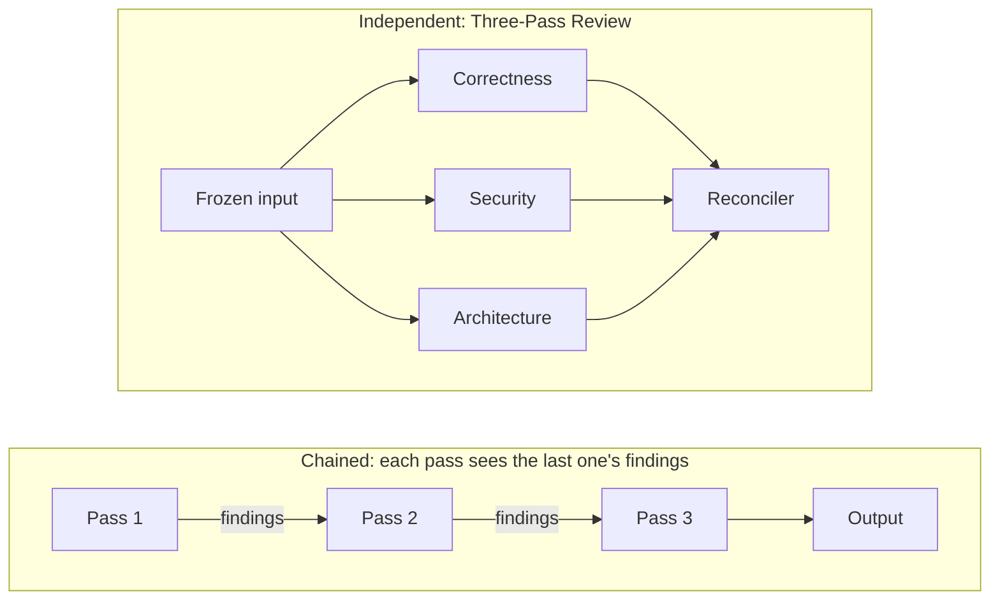
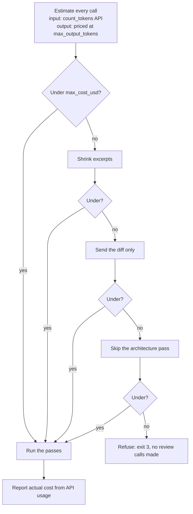
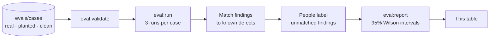

<div align="center">

# Three-Pass Review

**An AI code reviewer that publishes its own numbers.**

Three independent AI reviewers, one deterministic reconciler, a hard cost ceiling, and a public eval that measures whether any of it works.

[](https://www.ruby-lang.org)
[](LICENSE)
[](https://docs.anthropic.com)
[](test)
[](#roadmap)

[How it works](#how-it-works) · [Why this design](#why-this-design) · [Quick start](#quick-start) · [Results](#results) · [Engineering notes](#engineering-notes) · [Roadmap](#roadmap)

</div>

<p align="center">
  
</p>

## What it is

`threepass` is a command-line tool (and Ruby gem) that reviews a pull request's diff with **three specialized AI passes that never see each other's work**: correctness, security and data safety, and architecture. A deterministic reconciler merges what they find into **one short, ranked comment**. Every review runs under a **hard spending limit**, and every comment states what it cost.

Most AI review tools ask to be trusted. This one ships with an **eval harness and a public dataset** of real and planted bugs, and reports recall, precision and cost per pass with confidence intervals. You can rerun it with your own API key.

> **Status: early.** The CLI, the cost ceiling and the eval harness are built ([roadmap](#roadmap) M0 to M6). No eval has been run against the real API yet, so the results table below says *pending*. It fills in from `rake eval:report` once a labeled run exists. Until then there are no numbers to claim.

## Why this design

AI code review fails in a few predictable ways. Each part of Three-Pass Review targets one of them. These are design goals; [the eval](#results) is what decides whether they hold.

| The problem | What Three-Pass Review does | The benefit |
|---|---|---|
| **Anchoring.** A reviewer shown earlier findings works on that list instead of reading the code fresh, so one early miss becomes everyone's miss. | Three passes get the **same frozen input** and run in parallel. None sees another's output, and a test fails if one ever does. | Three genuinely independent looks at the change. |
| **Generalist prompts lose focus.** One prompt covering everything trades depth for breadth. | Each pass has **one job** and its own versioned prompt: correctness, security and data safety, or architecture. | The security pass isn't distracted by naming; the architecture pass reads your conventions files. |
| **Noise.** Duplicate, low-confidence or nitpicky comments train people to ignore the bot. | A **deterministic reconciler** merges duplicates, raises confidence when passes agree, drops findings below a threshold and caps the comment at 10. | One short comment where agreement is a signal, and the same input always produces the same output. |
| **Runaway cost.** Three passes cost roughly three times the input tokens of one. | A **hard ceiling** (`max_cost_usd`, default $0.50) is checked *before* any call. Over budget, it shrinks context, then skips a pass, then refuses. | Spend is predictable. Every comment reports its actual cost per pass. |
| **Untrusted input.** A PR can contain text aimed at the reviewer ("ignore previous instructions…"). | The model gets **no tools and no tokens**. Input is fenced with unforgeable markers, injection attempts are reported as findings, and output is escaped. | The worst a malicious PR can do is change the text of one comment. |
| **Unverifiable claims.** "Catches 90% of bugs" with no method behind it. | A **public eval** with real, planted and clean PRs, human labeling, and 95% Wilson intervals. Fake or stale runs can never reach this README. | You can check the numbers, rerun them, and see what it misses. |

### Independent, not chained



Chaining is cheaper, but it invites anchoring. Independence costs more and could produce duplicates; the reconciler and the cost ceiling deal with both. That trade-off is a claim, so the eval tests it: it runs the same dataset as **independent**, **chained**, **single** (one combined prompt) and **single, sampled three times** (the cost-matched control), and publishes the result whichever way it goes. The reasoning is in [ADR 0001](docs/decisions/0001-independent-passes.md).

## How it works

1. **Parse and gather context, deterministically.** The [diff parser](lib/three_pass_review/diff.rb) handles renames, binary files, new and deleted files and multiple hunks, and maps every line to its new line number. The [context builder](lib/three_pass_review/context_builder.rb) excerpts each changed file around its hunks and loads your conventions files (`CLAUDE.md`, `AGENTS.md`, `CONVENTIONS.md`, …). The result is one deep-frozen input.
2. **Plan under the ceiling.** The [budget](lib/three_pass_review/budget.rb) prices every planned call before making it, using the API's token counter and pricing output at its maximum.
3. **Run three isolated passes** in parallel ([runner](lib/three_pass_review/runner.rb), [prompts](lib/three_pass_review/prompts)). Each returns findings through **structured outputs**, a JSON schema the API enforces: file, new-file line range, category, severity, calibrated confidence, quoted evidence and a suggested fix.
4. **Reconcile** ([reconciler](lib/three_pass_review/reconciler.rb)):
   - validate every finding against the diff,
   - cluster duplicates that share a file, nearby lines, and a subcategory or similar title,
   - score with `1 − Π(1 − cᵢ)` across agreeing passes,
   - drop findings below the threshold,
   - rank by severity, confidence and agreement, and cap the list.
5. **Report** as a Markdown PR comment or JSON for machines, including cost and tokens per pass.

| Pass | Looks for |
|---|---|
| **Correctness** | Code that doesn't do what the PR says; nil, empty and boundary cases; off-by-one errors; swallowed errors; races and missing `await`; broken contracts; tests that don't test the change |
| **Security and data safety** | Injection (SQL, shell, path, template, header); missing authentication or authorization; IDOR; SSRF; secrets or PII in code and logs; unsafe deserialization; weak crypto; destructive operations without guards |
| **Architecture and conventions** | Fit with *your* codebase, judged against your conventions files and the visible code: layering, duplicated helpers, dead code, misleading names |

### The cost ceiling



Every degradation is listed in the comment. If pricing for the configured model is missing, the tool refuses rather than run under a ceiling it can't calculate.

## Results

<!-- eval:start -->
| | Recall (95% CI) | Precision (95% CI) | False positives per clean PR | Cost per review (median / p90) |
|---|---|---|---|---|
| Correctness pass | pending | pending | pending | pending |
| Security and data safety pass | pending | pending | pending | pending |
| Architecture pass | pending | pending | pending | pending |
| **Reconciled output** | pending | pending | pending | pending |

_Generated by `rake eval:report` from `evals/results/`. Never edited by hand. Dataset: pending._
<!-- eval:end -->

The table is written only by `rake eval:report`, from real-API runs on the current dataset. Each case in [`evals/cases/`](evals/cases) records its license, source PR and fix commit. The methodology is in [eval design](docs/eval-design.md):



- **Recall:** a defect counts as caught when a majority of its runs catch it, reported strict (right file, lines and category) and lenient (file and lines).
- **Precision:** stays hidden until at least 95% of findings carry a human label.
- **Groups with fewer than 8 defects** are shown as counts ("5 of 7"), never as percentages.
- **Every missed defect** gets a one-line reason in the run's `misses.md`.

## Quick start

**Requirements:** Ruby 3.3+ and Bundler. You'll need an [Anthropic API key](https://console.anthropic.com) for real reviews; the demo below needs none.

```bash
git clone https://github.com/lmagsino/three-pass-review.git
cd three-pass-review
bundle install
bundle exec rake          # the test suite and standardrb; no network needed
```

**See it work without an API key.** This replays recorded fixture responses through the full pipeline:

```bash
THREEPASS_FAKE=test/fixtures/llm/basic bundle exec exe/threepass review \
  --diff test/fixtures/diffs/basic.patch --repo test/fixtures/repo \
  --title "Add sortable invoices"
```

**Review a real change:**

```bash
export ANTHROPIC_API_KEY=sk-ant-...
git diff main...HEAD > change.patch
bundle exec exe/threepass review --diff change.patch --repo . \
  --title "Add sortable invoice columns" --body-file pr.md
```

| Flag | Meaning |
|---|---|
| `--diff PATH` or `-` | The unified diff to review (`-` reads stdin) |
| `--title`, `--body-file` | The PR's title and description; the correctness pass checks the code against them |
| `--repo PATH` | Checkout of the head version, used for excerpts and conventions (default `.`) |
| `--config PATH` | Config file (default `REPO/.threepass.yml`) |
| `--format markdown\|json` | A PR comment, or machine-readable output |
| `--fail-on SEVERITY` | Exit 2 if any finding is at least this severe; useful as a CI gate |
| `--no-cost-ceiling` | Run without pricing; spend is not capped |

Exit codes: **0** ran · **1** error · **2** findings at or above `--fail-on` · **3** refused by the cost ceiling.

### Example output

This is a rendering of the test fixtures: synthetic findings and token counts from [`test/fixtures/llm/basic`](test/fixtures/llm/basic), not a real review. The full rendering, with the details section, is in [`test/fixtures/golden/basic.md`](test/fixtures/golden/basic.md).

> ### threepass: 4 findings (1 high)
>
> | | Finding | Where | Passes | Confidence |
> |---|---|---|---|---|
> | 🔴 high | User input interpolated into SQL | `app/models/invoice.rb:8` | correctness, security | 0.96 |
> | 🟠 medium | Nil customer not handled in total_due | `app/models/invoice.rb:16` | correctness | 0.72 |
> | 🟠 medium | Model reads request params directly | `app/models/invoice.rb:7-9` | architecture | 0.70 |
> | 🟡 low | SORTABLE allow-list is defined but never used | `app/models/invoice.rb:5` | architecture | 0.66 |
>
> <sub>Cost · tokens per pass · findings below threshold · model · prompt version</sub>

The SQL finding was flagged by two passes independently, so its combined confidence (0.96) is higher than either pass's own.

### Configuration

Every key is optional. The defaults live in [`defaults.yml`](lib/three_pass_review/defaults.yml), which records the date its model ID and prices were checked against Anthropic's docs. Put overrides in `.threepass.yml`:

```yaml
model: claude-sonnet-5-5
max_cost_usd: 0.50          # hard ceiling per review
max_output_tokens: 4000     # per call; also bounds thinking tokens
effort: medium              # low | medium | high | xhigh | max
confidence_threshold: 0.6
max_comments: 10
passes:
  architecture:
    enabled: true
    conventions: [CLAUDE.md, AGENTS.md, CONVENTIONS.md, .github/copilot-instructions.md]
pricing:                    # USD per million tokens
  claude-sonnet-5-5: { input: 2.00, output: 10.00 }
```

A pull request can edit `.threepass.yml` in its own checkout. When reviewing changes you don't trust, pass `--config` pointing at a copy from a trusted branch.

### Run the eval yourself

```bash
bundle exec rake eval:validate                           # check every case
bundle exec rake "eval:run[independent]"                 # prints the most it could spend, then stops
CONFIRM=yes bundle exec rake "eval:run[independent]"     # the real run; also chained, single, single_sampled
bundle exec rake eval:report                             # rescore with your labels, update the table
```

To exercise the whole pipeline for free, run with `EVAL_FAKE=test/fixtures/eval_fake`. Fake runs are written to `tmp/` and are never published. [`evals/README.md`](evals/README.md) covers labeling and adding cases.

## Engineering notes

The design rests on a few guarantees. Each one is enforced by code and a test, not just by convention:

| Guarantee | How it's enforced |
|---|---|
| **Passes are independent** | Every request is built from one deep-frozen input before any thread starts. [`independence_test.rb`](test/independence_test.rb) asserts no request contains another pass's output or prompt, and it fails if findings are allowed to leak between passes. |
| **The ceiling is never exceeded** | [`budget_test.rb`](test/budget_test.rb) sweeps many ceilings across all four modes with a client that bills the maximum on every call. Every run either stays under its ceiling or refuses before making a review call. The SDK's automatic retries are off for billed calls, so one call can't be billed twice. |
| **No network in tests** | [`test_helper.rb`](test/test_helper.rb) refuses every socket. The real API client is tested against a fake SDK; a fake client replays fixtures. |
| **Untrusted input stays data** | Input is wrapped in BEGIN/END markers whose ids are 128-bit content hashes, so the input can't forge one. Symlinks and `.git/` are never read, and in a git checkout only tracked files are. Output escapes HTML, Markdown structure and `@mentions`. YAML is always loaded safely. |
| **No invented numbers** | The README table is written only by `rake eval:report`, and only from runs made against the real API on the current dataset version. Precision stays hidden until labels are 95% complete. |
| **Reproducible results** | Each run records the model, sampling settings, SHA-256 hashes of every prompt, the dataset version, the git SHA and the config. |

Choices worth knowing about:

- **A deterministic reconciler rather than an LLM one.** It's cheaper, testable and explainable. An LLM reconciler can become the default only if the eval shows it's better.
- **Structured outputs instead of a forced tool call.** The current Claude models reject forced `tool_choice`. A JSON schema the API enforces gives the same guarantee.
- **Model IDs and prices live in config, with dates, never in code.** They change; the code shouldn't have to.
- **Few dependencies.** The official `anthropic` gem plus the Ruby standard library; Minitest and standardrb for development.

### Project layout

```
exe/threepass                 CLI entry point
lib/three_pass_review/
  diff.rb                     unified diff parser
  context_builder.rb          excerpts, conventions, the frozen input
  budget.rb                   estimate, degrade, refuse, account
  runner.rb                   independent, chained, single, single_sampled
  passes/, prompts/           pass definitions and versioned prompts
  llm/                        Anthropic client, fake client, provider interface
  reconciler.rb               validate, cluster, score, threshold, rank, cap
  formatters/                 Markdown comment, JSON
  eval/                       cases, matcher, Wilson metrics, labels, scorer, report
evals/                        dataset, configs, labels, results
docs/                         design, eval design, ADRs, roadmap
guide/                        companion guide: AI review as one layer of a team process
```

## Roadmap

- [x] **M0** Gem scaffold, tests and linting
- [x] **M1** Diff parser and context builder
- [x] **M2** Prompts, structured findings, Anthropic and fake clients, four run modes
- [x] **M3** Cost ceiling: estimate, degrade, refuse, account
- [x] **M4** Deterministic reconciler, Markdown and JSON output
- [x] **M5** `threepass review` CLI
- [x] **M6** Eval harness and the first seed cases
- [ ] **M7** Grow the dataset to 40 cases, run all four configurations, label, publish the first results
- [ ] **M8** Become the agent-review layer of the [companion guide](guide)
- [ ] **Later** Inline line comments · a GitHub Action ([designed](docs/design.md#github-action)) · an LLM reconciler as an eval configuration · other model providers · reviewing only what changed since the last push

## Documentation

- [Design](docs/design.md): passes, finding schema, independence, reconciler, cost ceiling, outputs, config
- [Eval design](docs/eval-design.md): dataset, matching, labeling, configurations, statistics
- [ADR 0001: independent passes](docs/decisions/0001-independent-passes.md)
- [Roadmap](docs/roadmap.md)
- [Companion guide](guide): running AI review as one layer of a team's review process

## Contributing

Issues and pull requests are welcome, especially **eval cases**. Real bugs from permissively licensed projects, with their fix commits, are the most useful contribution there is. Read [CONTRIBUTING.md](CONTRIBUTING.md) first. To report a security problem, see [SECURITY.md](SECURITY.md).

## License and credits

MIT. See [LICENSE](LICENSE).

The companion guide's agent review uses Addy Osmani's MIT-licensed [`code-review-and-quality`](https://github.com/addyosmani/agent-skills/tree/main/skills/code-review-and-quality) skill. Eval cases come from MIT, Apache-2.0 and BSD-licensed projects, credited in each `case.yml`. This project is not affiliated with or endorsed by Anthropic, GitHub or Addy Osmani.
