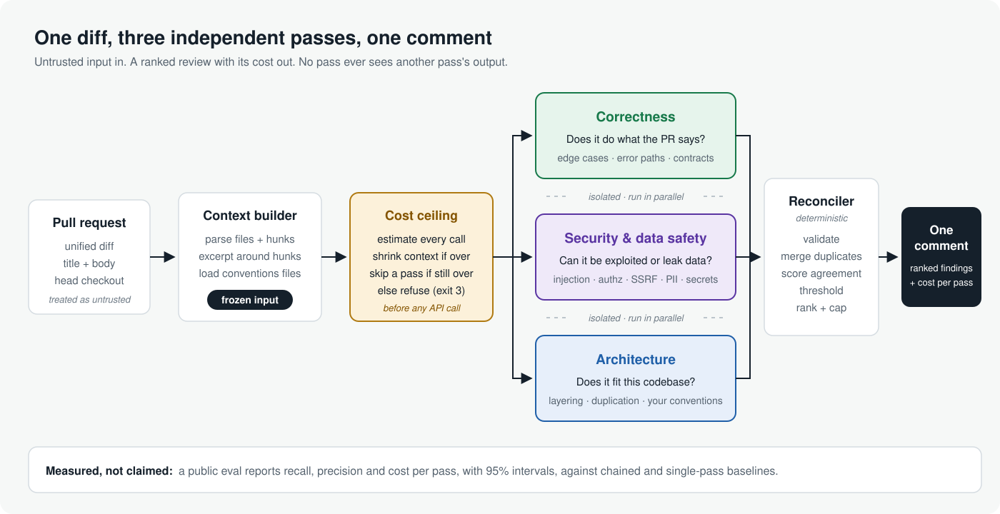

<div align="center">

# Three-Pass Review

**An AI code reviewer that publishes its own numbers.**

[](https://www.ruby-lang.org)
[](LICENSE)
[](docs/roadmap.md)

</div>

<p align="center">
  
</p>

Three-Pass Review (`threepass`) reviews a pull request with **three AI passes that never see each other's work**: correctness, security, and architecture. It merges what they find into **one short, ranked comment**, never spends more than a set limit, and comes with a **public eval** that measures how well it works.

> **Status: early.** Built and tested, but not yet evaluated against the real API, so there are no results to claim yet.

## Why

| Problem with AI review | What this does |
|---|---|
| Reviewers that see earlier findings anchor on them | Each pass reviews the same input independently; agreement between passes raises confidence |
| One do-everything prompt loses focus | Each pass has one job |
| Noisy, duplicated comments | A deterministic reconciler merges duplicates, drops low-confidence findings and caps the comment |
| Unpredictable cost | A hard ceiling is checked before any call: it trims context, then skips a pass, then refuses |
| Prompt injection from the PR | The model gets no tools; injection attempts are reported as findings |
| "Trust us" accuracy claims | A public dataset and eval with human labels and confidence intervals |

## Quick start

Requires Ruby 3.3+.

```bash
git clone https://github.com/lmagsino/three-pass-review.git
cd three-pass-review
bundle install
```

Try it without an API key (replays recorded responses):

```bash
THREEPASS_FAKE=test/fixtures/llm/basic bundle exec exe/threepass review \
  --diff test/fixtures/diffs/basic.patch --repo test/fixtures/repo --title "Add sortable invoices"
```

Review a real change:

```bash
export ANTHROPIC_API_KEY=sk-ant-...
git diff main...HEAD > change.patch
bundle exec exe/threepass review --diff change.patch --title "My change"
```

Run `bundle exec exe/threepass --help` for all options, and see [design: config](docs/design.md#config) to tune it with a `.threepass.yml`.

## Example output

This is rendered from test fixtures, not a real review:

> ### threepass: 4 findings (1 high)
>
> | | Finding | Where | Passes | Confidence |
> |---|---|---|---|---|
> | 🔴 high | User input interpolated into SQL | `app/models/invoice.rb:8` | correctness, security | 0.96 |
> | 🟠 medium | Nil customer not handled in total_due | `app/models/invoice.rb:16` | correctness | 0.72 |
> | 🟠 medium | Model reads request params directly | `app/models/invoice.rb:7-9` | architecture | 0.70 |

## Results

<!-- eval:start -->
| | Recall (95% CI) | Precision (95% CI) | False positives per clean PR | Cost per review (median / p90) |
|---|---|---|---|---|
| Correctness pass | pending | pending | pending | pending |
| Security and data safety pass | pending | pending | pending | pending |
| Architecture pass | pending | pending | pending | pending |
| **Reconciled output** | pending | pending | pending | pending |

_Generated by `rake eval:report` from `evals/results/`. Never edited by hand. Dataset: pending._
<!-- eval:end -->

This table is filled in only by `rake eval:report`, from real runs and human-labeled findings. See the [eval design](docs/eval-design.md) and the [dataset](evals).

## Learn more

- [Design](docs/design.md): how a review runs, the cost ceiling, the reconciler
- [Why independent passes](docs/decisions/0001-independent-passes.md)
- [Eval](evals/README.md): run it yourself, label findings, add cases
- [Roadmap](docs/roadmap.md)
- [Contributing](CONTRIBUTING.md) · [Security](SECURITY.md)

## License

MIT. See [LICENSE](LICENSE). Not affiliated with Anthropic.
