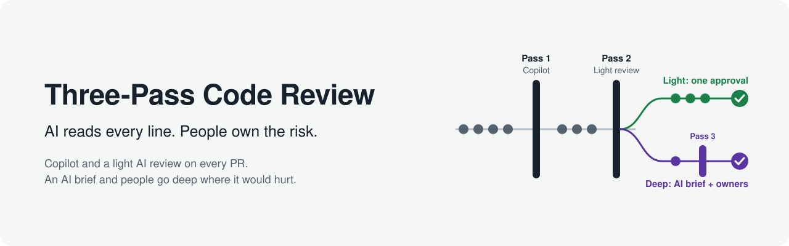
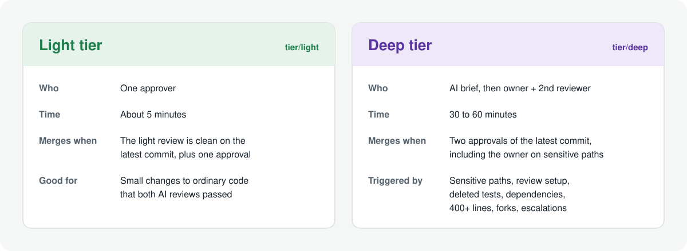
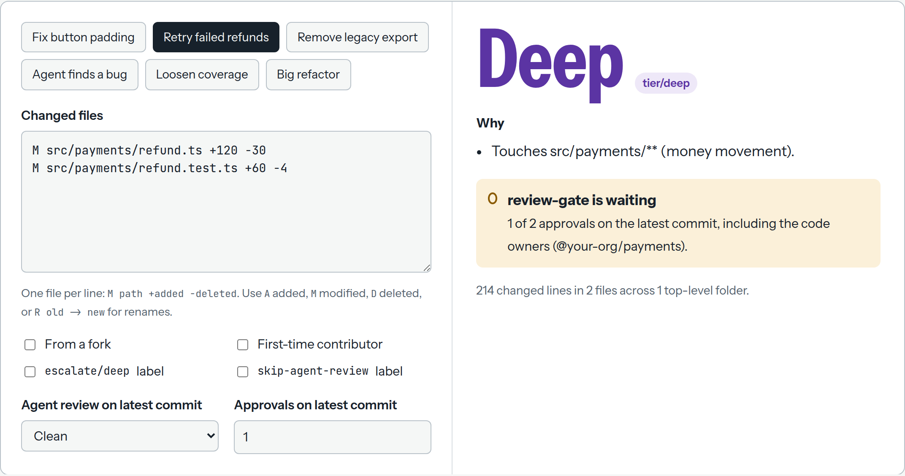

<p align="center">
  
</p>

**How we review code now that agents write most of it.** Every pull request gets two AI reviews. People do a deep review only where a mistake would really hurt.

This repo is a written guide plus a drop-in kit for GitHub: workflows, a routing policy, the review agent's instructions, a PR template and review checklists. It also comes with a small website that has an interactive demo of how PRs get routed.

## How it works

<p align="center">
  
</p>

| | What it does | Who | When |
|---|---|---|---|
| **Pass 1: Copilot** | Fast line comments on bugs, security, broken contracts and weakened tests, with one-click fixes | GitHub Copilot code review | Every PR, every push |
| **Pass 2: Agent review** | A five-axis review (correctness, readability, architecture, security, performance). It also checks blast radius, reports only findings it can verify, and recommends a tier, but can only escalate | An AI agent using [Addy Osmani's `code-review-and-quality` skill](https://github.com/addyosmani/agent-skills/tree/main/skills/code-review-and-quality) | Every ready PR, every push |
| **Pass 3: Deep review** | Verifies the tests, checks constraints and contracts, and makes sure the change can be rolled back | The code owner and a second reviewer | Only PRs routed to deep |

The agents never approve anything. Every PR still needs a person to approve it.

## Light or deep

<p align="center">
  
</p>

A tier check labels every PR `tier/light` or `tier/deep`, using rules read from the base branch. A PR goes **deep** when it:

- touches core or sensitive paths (auth, payments, migrations, infra: you choose),
- changes the review setup itself (workflows, policy, reviewer instructions),
- deletes tests, or loosens lint, test or coverage config,
- deletes source files, or changes dependencies,
- is over 400 changed lines, or spreads across many folders,
- comes from a fork or a first-time contributor,
- or is escalated by the agent review or by anyone on the team.

Automation can raise a tier but never lower one, and only a maintainer can remove an escalation. A required check called `review-gate` enforces both tiers:

- a **light** PR can't merge until the agent review is clean on its latest commit;
- a **deep** PR needs two approvals of its latest commit.

## Try the router

<p align="center">
  
</p>

[`site/index.html`](site/index.html) is a one-page website for this project. Pick an example PR or type its changed files, and it shows which tier the PR lands in, why, and what still blocks the merge. It uses the same rules as the kit. Open it in a browser, or publish it with GitHub Pages (see [below](#the-website)).

## Quick start

```bash
git clone https://github.com/<you>/three-pass-review.git
cd your-repo
bash ../three-pass-review/guide/scripts/install.sh .  # copies the kit into your repo
bash ../three-pass-review/guide/scripts/create-labels.sh your-org/your-repo
gh secret set ANTHROPIC_API_KEY -R your-org/your-repo
```

Then:

1. Set your sensitive paths in `.github/review-policy.yml` and `.github/CODEOWNERS`.
2. Turn on the branch ruleset and automatic Copilot review.
3. Merge the setup PR.
4. Make `review-gate` a required check once you go live.

Step by step: **[setup](docs/setup.md)**.

## Read the guide

1. [Why review has to change](docs/01-why.md): our approach and principles
2. [The flow](docs/02-the-flow.md): the three passes, the merge gate, the labels
3. [Pass 1: Copilot](docs/03-pass-1-copilot.md)
4. [Pass 2: the agent review](docs/04-pass-2-agent-review.md): what it checks, what it posts, how it's kept safe
5. [Pass 3: deep review](docs/05-pass-3-deep-review.md): how owners spend their time
6. [Routing: light or deep](docs/06-routing.md): the rules and how to tune them
7. [For authors](docs/07-for-authors.md): the PR contract, PR size, handling AI comments
8. [Earning trust](docs/08-earning-trust.md): measuring the agents, and moving areas between tiers
9. [Rollout](docs/09-rollout.md): from day one to live tiers in about a month

Plus [setup](docs/setup.md) and the [FAQ](docs/faq.md).

## What's in the repo

```
docs/                                          the guide, plus images/
site/index.html                                the website, with the router demo
templates/                                     copy into your repo (install.sh does it)
  .github/
    review-policy.yml                          routing rules: sensitive paths, thresholds, approvals
    CODEOWNERS                                 who signs off on sensitive paths
    copilot-instructions.md                    what pass 1 focuses on
    instructions/sensitive-paths.instructions.md
    pull_request_template.md                   the author's side of the contract
    review/light-review-checklist.md           the 5-minute human check
    review/deep-review-checklist.md            the owner's deep review
    workflows/review-tier.yml                  tier check + review-gate
    workflows/review-submitted.yml             re-checks the gate when someone approves
    workflows/agent-review.yml                 pass 2
    scripts/review-tier.mjs                    the tier rules and gate
    scripts/post-agent-review.sh               posts the agent summary, escalates
  .claude/review/
    agent-review.md                            pass 2 instructions
    skills/code-review-and-quality/            the review skill, pinned (fetched by the vendor script)
scripts/
  install.sh                                   copy the kit into a repo
  vendor-addy-skill.sh                         fetch the review skill at a pinned commit
  create-labels.sh                             create the labels
tests/review-tier.test.mjs                     node --test
```

## Design choices

- **Two different AI reviewers.** Different tools catch different bugs. The pass 2 skill sits in `.claude/review/skills/` rather than `.claude/skills/`, so Copilot doesn't load it and the two passes stay different.
- **AI reviews are sensors, not verdicts.** The agent can't approve, push or change labels. It returns its verdict as data, and a plain script acts on it.
- **Escalate only.** The agent and people can move a PR to deep. Nothing automated can move it back, and if the PR's author removes an escalation, it's put back.
- **A PR can't change its own reviewer.** The rules are read from the base branch, and so are the agent's instructions. Any PR that touches the review setup goes to deep.
- **A failed review is never a clean one.** The gate needs a clean agent review of the exact latest commit.
- **GitHub's own rules are the hard guarantees.** CODEOWNERS, required approvals, and approval of the most recent push. The gate makes the right path the easy one ([what it does and doesn't protect against](docs/06-routing.md#what-the-gate-does-and-doesnt-protect-against)).

## The website

`site/index.html` is a single static page with no build step. To publish it:

1. Push the repo to GitHub.
2. Go to **Settings → Pages** and set **Source** to **GitHub Actions**.

The repo's `.github/workflows/pages.yml` then deploys it on every push to `main`.

## Credits

- **Pass 2** uses Addy Osmani's [`code-review-and-quality`](https://github.com/addyosmani/agent-skills/tree/main/skills/code-review-and-quality) skill from [agent-skills](https://github.com/addyosmani/agent-skills) (MIT). The kit downloads it at a pinned commit, with its license notice, rather than copying it into this repo.
- **Pass 2 runs on** [anthropics/claude-code-action](https://github.com/anthropics/claude-code-action).
- **Pass 1 is** [GitHub Copilot code review](https://docs.github.com/en/copilot/how-tos/use-copilot-agents/request-a-code-review/use-code-review).

Not affiliated with or endorsed by Addy Osmani, GitHub or Anthropic.

## License

MIT. See [LICENSE](LICENSE). Contributions welcome: see [CONTRIBUTING](CONTRIBUTING.md).
