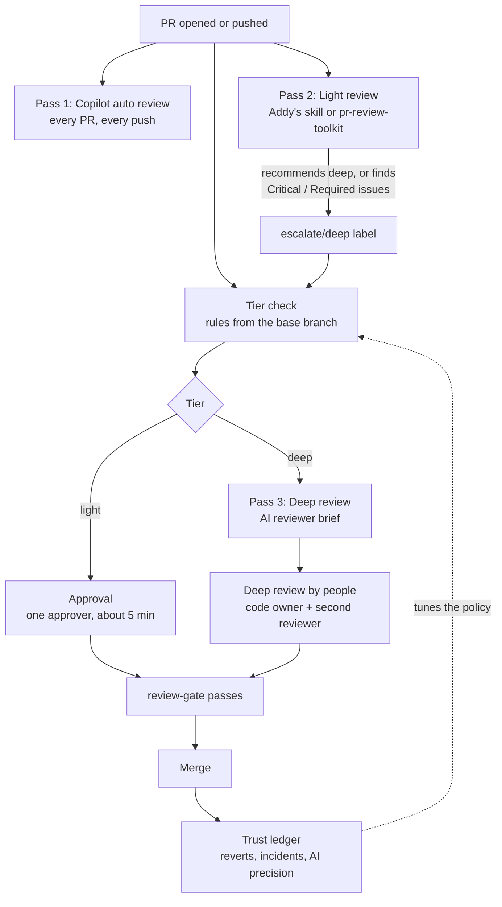

# 2. The flow

Every PR goes through the same pipeline. The effort grows with the risk: two AI passes on every PR, and a third, deeper pass (an AI brief and then two people) only where a mistake would really hurt.

## The three passes

| | Pass 1: Auto review | Pass 2: Light review | Pass 3: Deep review |
|---|---|---|---|
| **Who** | GitHub Copilot code review | An AI reviewer in CI: Addy Osmani's `code-review-and-quality` skill, or Claude Code's `pr-review-toolkit` (your choice in the policy) | An AI reviewer brief (`threepass`), then the code owner and a second reviewer |
| **Runs on** | Every PR, every push | Every non-draft PR from the repo, every push | Only PRs routed to deep |
| **Takes** | Seconds to a few minutes | A few minutes | The brief: minutes. The people: 30–60 minutes |
| **Looks for** | Line-level bugs, security slips, missing tests | Five axes, blast radius, recoverability, intent vs. code | The brief: the change at a high level, impact, risks, rollback, test gaps, plus three independent AI checks. The people: verification, constraints, recoverability, comprehension |
| **Produces** | Line comments with suggested fixes | One summary comment, inline comments for Critical/Required only, a tier recommendation | A reviewer brief with a pre-filled sign-off draft; then approvals with a sign-off note, or change requests |
| **Can approve?** | No (comment-only by default) | No, never | The brief: no. The people: yes |
| **Can block?** | No | Light PRs can't merge until it's clean on the latest commit; it can escalate to deep | The brief: no. The people: yes |

Light-tier PRs still get a human approval: a 5-minute look by one approver, using the [approval checklist](../templates/.github/review/approval-checklist.md), after both AI reviews are clean. The light tier skips the deep read, not the human.

## The merge gate

The tier check publishes a commit status called **`review-gate`** on the PR's latest commit. Make it a required status check, and the tiers stop being just labels:

| Tier | `review-gate` passes when |
|---|---|
| Light | The light review finished and is **clean on the latest commit**. Plus the ruleset's normal 1 approval. |
| Deep | At least **2 people** (not the author, not bots) **approved the latest commit**. On sensitive paths, CODEOWNERS also requires that one of them is an owner. |

An approval given before the light review escalates doesn't sneak a PR through: once it's deep, the gate asks for two approvals of the latest commit. A new push resets both conditions.

## Timeline of one PR

1. **Author opens the PR** with the template filled in: what and why, proof it works, risk, key decisions, review focus. See [for authors](07-for-authors.md).
2. **Within seconds**, the tier check labels it `tier/light` or `tier/deep`, posts a comment saying why, and sets `review-gate` to pending.
3. **Within a few minutes**, Copilot leaves line comments and the light review posts its summary. The tier check runs again:
   - If the light review recommends deep, or finds a Critical or Required issue, it adds `escalate/deep` and the PR moves to deep.
   - If it's clean on a light PR, the gate turns green.
   - If the PR is deep, the tier check starts pass 3, which posts the **reviewer brief** a few minutes later.
4. **The author fixes or answers** every Critical and Required comment, and pushes. Everything runs again on the new commit.
5. **A human reviews**:
   - `tier/light`: any team member with approval rights, using the approval checklist.
   - `tier/deep`: the code owner and a second reviewer, starting from the reviewer brief and using the [deep review checklist](../templates/.github/review/deep-review-checklist.md). Each approval re-runs the tier check and updates the gate.
6. **Merge.** If something goes wrong later, the revert or incident is traced back to the PR and its tier. That's the [trust ledger](08-earning-trust.md).

## Labels

| Label | Set by | Meaning |
|---|---|---|
| `tier/light` | Tier check | Passes 1 and 2 plus one approval are enough |
| `tier/deep` | Tier check | Pass 3: a reviewer brief, then a deep review with the owner's sign-off |
| `escalate/deep` | Light review, or any person | Forces deep. Sticky: automation never removes it, and if anyone but a maintainer removes it (including the PR author), the tier check puts it back |
| `needs-split` | Tier check | Past the split threshold (default 1,000 lines). Please break it up |
| `skip-light-review` | A person | Don't run pass 2 on this PR. With no light review there's nothing to clear the light tier, so this also makes the PR deep |

The tier check is the only thing that sets `tier/*` labels. Everything else escalates through `escalate/deep`, so there's one source of truth.

## What runs where

| File | Job |
|---|---|
| `.github/workflows/review-tier.yml` + `.github/scripts/review-tier.mjs` | Tier check and merge gate. Runs on `pull_request_target` from the trusted branch and never runs PR code |
| `.github/workflows/review-submitted.yml` | Wakes the tier check when someone approves, so the gate updates |
| `.github/review-policy.yml` | The routing rules: sensitive paths, thresholds, approvals needed |
| `.github/copilot-instructions.md`, `.github/instructions/*.instructions.md` | What Copilot focuses on (pass 1) |
| `.github/workflows/light-review.yml` + `.github/scripts/post-light-review.sh` | Light review (pass 2) |
| `.claude/review/light-review.md`, `.claude/review/methods/*.md` | The light reviewer's protocol, and one method per reviewer choice |
| `.claude/review/skills/code-review-and-quality/SKILL.md` | Addy Osmani's review skill (pinned copy), used when `light_review.reviewer` is `addy` |
| `.github/workflows/deep-review.yml` + `.github/scripts/post-deep-review.sh` | The reviewer brief (pass 3), on deep-tier PRs, from `threepass` at a pinned commit |
| `.github/CODEOWNERS` | Who must approve on sensitive paths (GitHub enforces it) |
| `.github/pull_request_template.md` | The author's side of the contract |
| `.github/review/approval-checklist.md`, `deep-review-checklist.md` | What people do on light and deep PRs |

Next: [pass 1, Copilot](03-pass-1-copilot.md).
