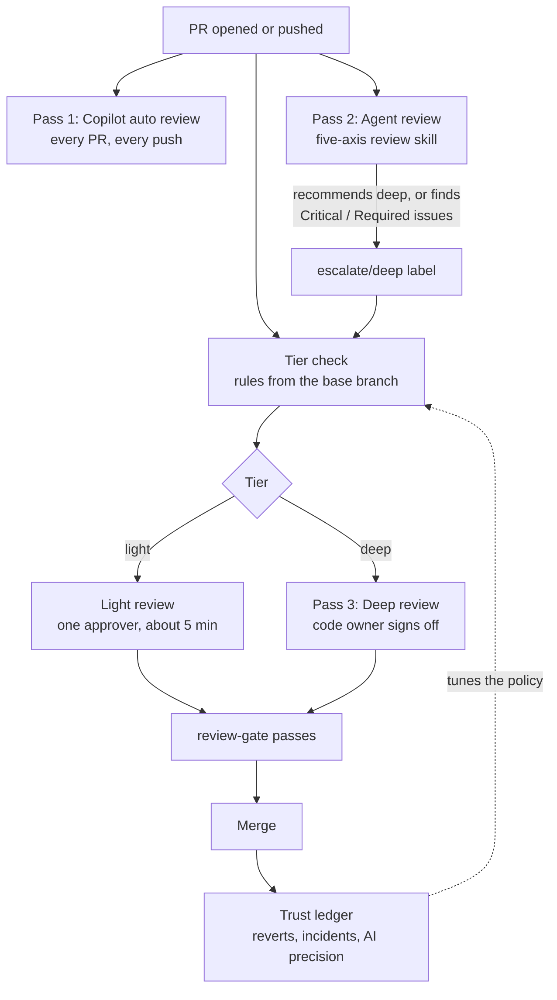

# 2. The flow

Every PR goes through the same pipeline. What changes is how much human time it gets at the end.

## The three passes

| | Pass 1: Copilot auto review | Pass 2: Agent review | Pass 3: Deep review |
|---|---|---|---|
| **Who** | GitHub Copilot code review | An agent (Claude Code in CI by default) following Addy Osmani's `code-review-and-quality` skill | A code owner, plus a second reviewer |
| **Runs on** | Every PR, every push | Every non-draft PR from the repo, every push | Only PRs routed to deep |
| **Takes** | Seconds to a few minutes | A few minutes | 30–60 minutes |
| **Looks for** | Line-level bugs, security slips, missing tests | Five axes, blast radius, recoverability, intent vs. code | Verification, constraints, recoverability, comprehension |
| **Produces** | Line comments with suggested fixes | One summary comment, inline comments for Critical/Required only, a tier recommendation | Approvals with a sign-off note, or change requests |
| **Can approve?** | No (comment-only by default) | No, never | Yes |
| **Can block?** | No | Light PRs can't merge until it's clean on the latest commit; it can escalate to deep | Yes |

Light-tier PRs still get a human approval. The light check is a 5-minute look by one approver, using the [light review checklist](../templates/.github/review/light-review-checklist.md), after both AI reviews are clean. Light review skips the deep read, not the human.

## The merge gate

The tier check publishes a commit status called **`review-gate`** on the PR's latest commit. Make it a required status check, and the tiers stop being just labels:

| Tier | `review-gate` passes when |
|---|---|
| Light | The agent review finished and is **clean on the latest commit**. Plus the ruleset's normal 1 approval. |
| Deep | At least **2 people** (not the author, not bots) **approved the latest commit**. On sensitive paths, CODEOWNERS also requires that one of them is an owner. |

An approval given before the agent escalates doesn't sneak a PR through: once it's deep, the gate asks for two approvals of the latest commit. A new push resets both conditions.

## Timeline of one PR

1. **Author opens the PR** with the template filled in: what and why, proof it works, risk, key decisions, review focus. See [for authors](07-for-authors.md).
2. **Within seconds**, the tier check labels it `tier/light` or `tier/deep`, posts a comment saying why, and sets `review-gate` to pending.
3. **Within a few minutes**, Copilot leaves line comments and the agent posts its summary. The tier check runs again:
   - If the agent recommends deep, or finds a Critical or Required issue, it adds `escalate/deep` and the PR moves to deep.
   - If it's clean on a light PR, the gate turns green.
4. **The author fixes or answers** every Critical and Required comment, and pushes. Everything runs again on the new commit.
5. **A human reviews**:
   - `tier/light`: any team member with approval rights, using the light checklist.
   - `tier/deep`: the code owner and a second reviewer, using the [deep review checklist](../templates/.github/review/deep-review-checklist.md). Each approval re-runs the tier check and updates the gate.
6. **Merge.** If something goes wrong later, the revert or incident is traced back to the PR and its tier. That's the [trust ledger](08-earning-trust.md).

## Labels

| Label | Set by | Meaning |
|---|---|---|
| `tier/light` | Tier check | Light review is enough |
| `tier/deep` | Tier check | Deep review, owner signs off |
| `escalate/deep` | Agent review, or any person | Forces deep. Sticky: automation never removes it, and if anyone but a maintainer removes it (including the PR author), the tier check puts it back |
| `needs-split` | Tier check | Past the split threshold (default 1,000 lines). Please break it up |
| `skip-agent-review` | A person | Don't run pass 2 on this PR. With no agent review there's nothing to clear a light review, so this also makes the PR deep |

The tier check is the only thing that sets `tier/*` labels. Everything else escalates through `escalate/deep`, so there's one source of truth.

## What runs where

| File | Job |
|---|---|
| `.github/workflows/review-tier.yml` + `.github/scripts/review-tier.mjs` | Tier check and merge gate. Runs on `pull_request_target` from the trusted branch and never runs PR code |
| `.github/workflows/review-submitted.yml` | Wakes the tier check when someone approves, so the gate updates |
| `.github/review-policy.yml` | The routing rules: sensitive paths, thresholds, approvals needed |
| `.github/copilot-instructions.md`, `.github/instructions/*.instructions.md` | What Copilot focuses on (pass 1) |
| `.github/workflows/agent-review.yml` + `.github/scripts/post-agent-review.sh` | Agent review (pass 2) |
| `.claude/review/agent-review.md` | The agent's instructions |
| `.claude/review/skills/code-review-and-quality/SKILL.md` | The review skill (Addy Osmani's, pinned copy) |
| `.github/CODEOWNERS` | Who must approve on sensitive paths (GitHub enforces it) |
| `.github/pull_request_template.md` | The author's side of the contract |
| `.github/review/*-checklist.md` | What humans do in light and deep reviews |

Next: [pass 1, Copilot](03-pass-1-copilot.md).
