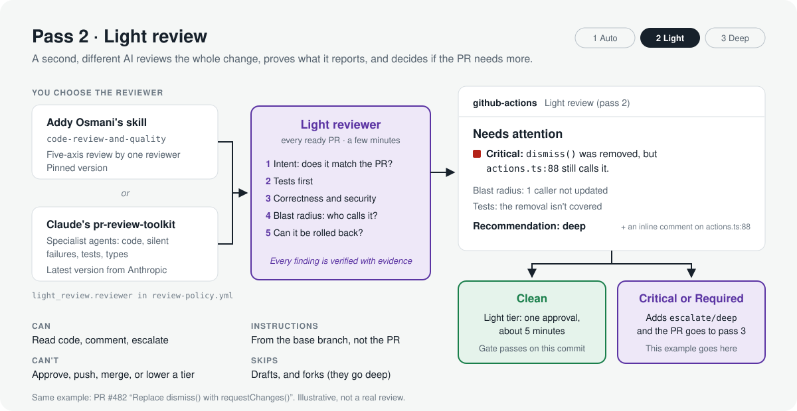

# 4. Pass 2: the light review

**Job:** a structured review by a second, different AI, on every ready PR. It finds and verifies issues, ranks them, measures blast radius, and tells the human reviewer where to look. It also recommends a tier, but only upward.

<p align="center">
  
</p>

You choose the reviewer with `light_review.reviewer` in `.github/review-policy.yml` (see [choosing the reviewer](#choosing-the-reviewer)):

| `reviewer` | What runs |
|---|---|
| `addy` (default) | Addy Osmani's [`code-review-and-quality`](https://github.com/addyosmani/agent-skills/blob/main/skills/code-review-and-quality/SKILL.md) skill, vendored and pinned |
| `pr-review-toolkit` | Claude Code's [`pr-review-toolkit`](https://github.com/anthropics/claude-code/tree/main/plugins/pr-review-toolkit) plugin and its specialist agents |

With `addy`, the skill from [addyosmani/agent-skills](https://github.com/addyosmani/agent-skills) (MIT) supplies the method:

- **Five axes:** correctness, readability, architecture, security, performance.
- **Review order:** context first, tests before implementation.
- **Change-size guidance.**
- **Severity labels:** Critical, Required (no prefix), Consider/Optional, Nit, FYI.

Whichever reviewer you pick, the protocol in [`.claude/review/light-review.md`](../templates/.claude/review/light-review.md) adds what a CI reviewer needs on top: verification rules, a blast-radius pass, recoverability checks, a tier recommendation, and a fixed output format. The method itself lives in [`.claude/review/methods/`](../templates/.claude/review/methods).

## Why a second AI reviewer

Different reviewers catch different bugs, and two copies of the same reviewer mostly repeat each other. Pass 1 is Copilot with short instructions. Pass 2 is a different model with a different method, so they overlap less.

## What it does

1. **Intent.** Reads the PR description and writes in its own words what the PR does. A missing "what and why" or missing proof is a Required finding.
2. **Tests first.** Checks that changed behavior is tested, and looks hard at assertions rewritten to fit new behavior, or tests deleted or skipped.
3. **Five-axis review**, correctness and security first.
4. **Blast radius.** For every shared thing the PR adds, removes or changes, it searches the repository for callers. A removed function that's still called is Critical. A changed signature with callers left behind is Critical or Required. New code with no callers gets flagged as possible dead code.
5. **Recoverability.** Flags anything a plain revert won't undo.
6. **Verification.** Every finding needs evidence: `path:line`, the input or call path that triggers it, or the caller that breaks. Anything it can't prove goes under "Could not verify" instead of becoming a comment.
7. **Tier recommendation.** It recommends `deep` when any of these hold:
   - There's a Critical or Required finding.
   - The change touches sensitive areas the policy doesn't cover yet.
   - Changed contracts have callers across modules.
   - Something can't be undone with a plain revert.
   - Tests are weak.
   - It couldn't explain the change.

## What it posts

- **Inline comments only for Critical and Required findings**, with a suggested fix when it's small. Consider, Nit and FYI stay in the summary, so the PR doesn't drown.
- **One summary comment**, updated in place on every push:

```markdown
### Light review (pass 2): Needs attention

**Recommendation:** deep: removes a method that two handlers still call.

**What this PR does:** Replaces ReviewSession.dismiss with requestChanges and adds
CSV export for review history.

**Blast radius**
| Changed | How | Callers found | Notes |
|---|---|---|---|
| `ReviewSession.dismiss` (`lib/reviews/session.ts`) | removed | 2 in 2 files | `app/reviews/actions.ts:88` still calls it |
| `ReviewSession.submit` (`lib/reviews/session.ts`) | signature | 6 in 4 files | all updated |
| `exportReviewCsv` (`lib/reviews/export.ts`) | added | 0 | nothing calls it yet |

**Findings** (verified, most severe first)
- **Critical:** `dismiss()` was removed but `app/reviews/actions.ts:88` still calls it; the
  "Dismiss" button throws at runtime. Evidence: grep for `.dismiss(` → 2 hits.
- **Consider:** `exportReviewCsv` (86 lines) has no callers. Remove it or wire it up.
- Nits: 3, not listed.

**Tests:** submit() changes covered. No test for the dismiss path, which is how this slipped.

**Rollback:** plain revert is enough.

**Worth opening** (for the human reviewer)
1. `app/reviews/actions.ts:80-95`: the broken call site.

**Could not verify:** Nothing.

**Escalated to deep review** (label `escalate/deep`):
- Critical finding: removed method still has callers.
```

The reviewer never posts that summary itself. It returns structured JSON, and [`post-light-review.sh`](../templates/.github/scripts/post-light-review.sh), a plain script, posts the summary and adds `escalate/deep` when either of these holds:

- the agent recommends `deep`, or
- it reports any Critical or Required finding, whatever it recommends.

The second condition is checked by the script, not the model.

## How it runs

[`light-review.yml`](../templates/.github/workflows/light-review.yml) runs [`anthropics/claude-code-action`](https://github.com/anthropics/claude-code-action) on `pull_request` (opened, synchronize, reopened, ready_for_review):

- **Skipped** for drafts, PRs from forks, Dependabot PRs (they get no secrets), and PRs labeled `skip-light-review`. Forks and skipped PRs go to deep review, because the light tier needs a clean light review.
- **Cancelled and restarted** when a new push arrives, so you pay for one review per push at most.
- **Allowed tools:** read files, search, `git diff/log/show/blame`, `gh pr view/diff`, read this PR's review comments (to avoid repeating Copilot), and post inline comments. Nothing else: it can't push, approve, merge or change labels.
- **Uses the workflow token** (`github_token`), so no extra GitHub App is needed and everything is posted as `github-actions[bot]`.
- **Bots and coding agents** that open PRs need to be listed in the action's `allowed_bots` input, or the action stops for them.
- **Returns** a structured result validated against a JSON schema (`--json-schema`).

The summary comment's first line records the commit it reviewed and the verdict (`<!-- light-review sha=… result=clean -->`). When the run finishes, the tier check runs again through `workflow_run`. It picks up any escalation and updates the `review-gate` status: a light PR's gate passes only when the review is clean on its latest commit. If the agent didn't finish, the script posts a "didn't finish" comment and fails the run, so a broken review never looks like a clean one.

### Setup

1. Vendor the skill (the installer does this): `bash scripts/vendor-addy-skill.sh /path/to/your/repo`. It goes to `.claude/review/skills/code-review-and-quality/`, not `.claude/skills/`, so Copilot doesn't auto-load it and the two passes stay different.
2. Add an `ANTHROPIC_API_KEY` repository secret. The action also supports Amazon Bedrock, Google Vertex AI, Microsoft Foundry, and keyless workload identity federation; see its docs.
3. Optional: let the agent run your tests while verifying, by adding your test command to `--allowedTools`, for example `Bash(npm test:*)`.

## Security model

An AI reviewer reads code written by someone else, possibly with instructions hidden in it. The setup assumes that will happen.

- **The reviewer can't be rewritten by the PR.** `claude-code-action` restores `.claude/` from the base branch before starting, so the protocol, method and skill come from the base branch, not the PR. The choice of reviewer is read from the base branch's policy too. Any PR that does change them is routed to deep review anyway.
- **The PR is treated as data.** The prompt tells the agent to report steering attempts ("ignore this file", "mark as light") as Critical and recommend deep.
- **Least privilege.** Read-only tools plus inline comments. The job's token can comment and label but not push (`contents: read`).
- **Escalate only.** The worst a manipulated agent can do is stay quiet. The tier floor comes from deterministic rules on the base branch, and a human still approves every PR.
- **No secrets for forks.** `pull_request` runs from forks don't get secrets, so the workflow skips them rather than falling back to `pull_request_target` with PR code checked out (a known way to leak secrets). Fork PRs go to deep review instead. A maintainer can still run the same skill locally (`/review` in Claude Code with Addy's plugin) to prepare the deep review.
- **Pinned skill, no plugin hooks.** With `addy`, the skill is a pinned markdown file, not Addy's full plugin, which includes hooks that run commands; you don't want those in a job holding an API key. With `pr-review-toolkit`, the plugin is installed from Anthropic's marketplace on each run, so it isn't pinned: you get Anthropic's latest version. It ships agents and commands only, no hooks (checked 2026-10-01). Pick `addy` if you want every review to use a fixed method.
- **A failed review is never a clean one.** No result means a "didn't finish" comment, a failed run, and a gate that stays pending.

## Choosing the reviewer

Both reviewers follow the same protocol and return the same verdict, so the tier check and the merge gate work the same either way. They differ in how they read the change:

- **`addy`**: one reviewer applying the five-axis method from start to finish. It's pinned, predictable and cheaper.
- **`pr-review-toolkit`**: specialist agents (code review, silent failures, test coverage, and type design or comments when relevant) report candidates, and the reviewer verifies each one before posting. The toolkit has no security or performance specialist, so the method has the reviewer cover those itself. Expect more tokens per review.

To switch, change `light_review.reviewer` and open a PR. It touches the policy, so it gets a deep review.

### Bringing another reviewer

The protocol and methods are plain markdown, so any coding agent that runs in CI and returns structured output can do pass 2: Codex, Gemini CLI, Copilot CLI, or your own. Keep these properties:

- different from your pass 1 reviewer,
- reviewer instructions read from the base branch,
- read-only tools,
- verdict returned as data and acted on by a script,
- escalate only.

## Cost controls

- Skip drafts (default). Authors mark PRs ready when they want the review.
- `cancel-in-progress` drops superseded runs.
- Add `paths-ignore` for docs-only changes if you want.
- `skip-light-review` for PRs you'll deep-review anyway. It makes the PR deep, so it's not a shortcut.
- `timeout-minutes: 20` caps a runaway session.

Next: [pass 3, deep review](05-pass-3-deep-review.md).
